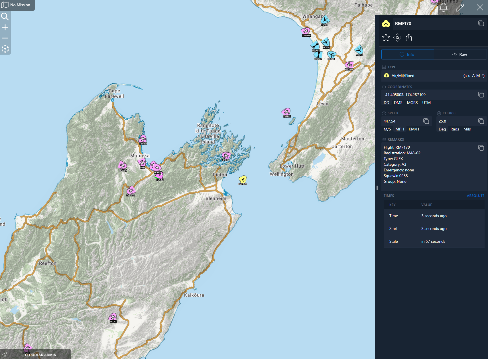

# ETL-ADSBX</h1>

<p align='center'>Aircraft location data via ADS-B</p>

## Data Source

[ADSBExchange.com](https://www.adsbexchange.com/)

### Supported icons for public safety aircraft
* a-f-A-M-F-A = Friendly Military Fixed Wing - Attack Aircraft
* a-f-A-M-F-C = Friendly Military Fixed Wing - Cargo Aircraft
* a-f-A-M-F-J = Friendly Military Fixed Wing - Jammer Aircraft
* a-f-A-M-F-O = Friendly Military Fixed Wing - Observation Aircraft
* a-f-A-M-F-Q = Friendly Military Fixed Wing - Drone Aircraft
* a-f-A-M-F-R-Z = Friendly Military Fixed Wing - Rescue Amphibian
* a-f-A-M-F-R = Friendly Military Fixed Wing - Reconnaissance Aircraft
* a-f-A-M-F-U = Friendly Military Fixed Wing - Utility Aircraft
* a-f-A-M-F-V = Friendly Military Fixed Wing - VIP Transport
* a-f-A-M-F-WX = Friendly Military Fixed Wing - Weather Aircraft
* a-f-A-M-F-Y = Friendly Military Fixed Wing - Training Aircraft
* a-f-A-M-H-H = Friendly Military Helicopter - Hospital/Medical
* a-f-A-M-H-R = Friendly Military Helicopter - Reconnaissance
* a-f-A-M-H-V = Friendly Military Helicopter - VIP Transport
* a-f-A-M-H = Friendly Military Helicopter - Generic
* a-n-A-M-F-V = Neutral Military Fixed Wing - VIP Transport
* CIV_FIXED_CAP = Civilian Fixed Wing - Civil Air Patrol
* CIV_FIXED_ISR = Civilian Fixed Wing - Intelligence/Surveillance/Reconnaissance
* CIV_LTA_AIRSHIP = Civilian Lighter Than Air - Airship
* CIV_LTA_BALLOON = Civilian Lighter Than Air - Balloon
* CIV_LTA_TETHERED = Civilian Lighter Than Air - Tethered
* CIV_ROTOR_ISR = Civilian Helicopter - Intelligence/Surveillance/Reconnaissance
* CIV_UAS = Civilian Unmanned Aircraft System
* CIV_UAS_ROTOR = Civilian Unmanned Helicopter System
* EMS_FIXED_WING = Emergency Medical Services Fixed Wing
* EMS_ROTOR = Emergency Medical Services Helicopter
* EMS_ROTOR_RESCUE = Emergency Medical Services Rescue Helicopter
* FIRE_AIR_ATTACK = Fire Service Command/Control Aircraft
* FIRE_AIR_TANKER = Fire Service Tanker Aircraft
* FIRE_INTEL = Fire Service Intelligence Aircraft
* FIRE_LEAD_PLANE = Fire Service Lead Aircraft
* FIRE_MULTI_USE = Fire Service Multi-Purpose Aircraft
* FIRE_ROTOR = Fire Service Helicopter
* FIRE_ROTOR_AIR_ATTACK = Fire Service Command/Control Helicopter
* FIRE_ROTOR_INTEL = Fire Service Intelligence Helicopter
* FIRE_ROTOR_RESCUE = Fire Service Rescue Helicopter
* FIRE_SEAT = Fire Service Single Engine Air Tanker
* FIRE_SMOKE_JMPR = Fire Service Smoke Jumper Aircraft
* FIRE_UAS = Fire Service Unmanned Aircraft System
* LE_FIXED_WING = Law Enforcement Fixed Wing
* LE_FIXED_WING_ISR = Law Enforcement Fixed Wing ISR
* LE_ROTOR = Law Enforcement Helicopter
* LE_ROTOR_RESCUE = Law Enforcement Rescue Helicopter
* LE_UAS = Law Enforcement Unmanned Aircraft System
* FED_FIXED_WING = Federal Agency Fixed Wing
* FED_FIXED_WING_ISR = Federal Agency Fixed Wing ISR
* FED_ROTOR = Federal Agency Helicopter
* FED_ROTOR_RESCUE = Federal Agency Rescue Helicopter
* FED_UAS = Federal Agency Unmanned Aircraft System
* MIL_ROTOR_MED_RESCUE = Military Medical Rescue Helicopter
* MIL_ROTOR_ISR_RESCUE = Military ISR/Rescue Helicopter

## Example Data



## Deployment

Deployment into the CloudTAK environment for ETL tasks is done via automatic releases to the TAK.NZ AWS environment.

Github actions will build and push docker releases on every version tag which can then be automatically configured via the
CloudTAK API.

### GitHub Actions Setup

The workflow uses GitHub variables and secrets to make it reusable across different ETL repositories.

#### Organization Variables (recommended)
- `DEMO_STACK_NAME`: Name of the demo stack (default: "Demo")
- `PROD_STACK_NAME`: Name of the production stack (default: "Prod")

#### Organization Secrets (recommended)
- `DEMO_AWS_ACCOUNT_ID`: AWS account ID for demo environment
- `DEMO_AWS_REGION`: AWS region for demo environment
- `DEMO_AWS_ROLE_ARN`: IAM role ARN for demo environment
- `PROD_AWS_ACCOUNT_ID`: AWS account ID for production environment
- `PROD_AWS_REGION`: AWS region for production environment
- `PROD_AWS_ROLE_ARN`: IAM role ARN for production environment

#### Repository Variables
- `ETL_NAME`: Name of the ETL (default: repository name)

#### Repository Secrets (alternative to organization secrets)
- `AWS_ACCOUNT_ID`: AWS account ID for the environment
- `AWS_REGION`: AWS region for the environment
- `AWS_ROLE_ARN`: IAM role ARN for the environment

These variables and secrets can be set in the GitHub organization or repository settings under Settings > Secrets and variables.

### Manual Deployment

For manual deployment you can use the `scripts/etl/deploy-etl.sh` script from the [CloudTAK](https://github.com/TAK-NZ/CloudTAK/) repo.
As an example: 
```
../CloudTAK/scripts/etl/deploy-etl.sh Demo v1.0.0 --profile tak-nz-demo
```

### CloudTAK Configuration

When registering this ETL as a task in CloudTAK:

- Use the `<repo-name>.png` file in the main folder of this repository as the Task Logo
- Use the raw GitHub URL of this README.md file as the Task Markdown Readme URL

This will ensure proper visual identification and documentation for the task in the CloudTAK interface.

## Development

TAK.NZ provided Lambda ETLs are currently all written in [NodeJS](https://nodejs.org/en) through the use of a AWS Lambda optimized
Docker container. Documentation for the Dockerfile can be found in the [AWS Help Center](https://docs.aws.amazon.com/lambda/latest/dg/images-create.html)

```sh
npm install
```

Add a .env file in the root directory that gives the ETL script the necessary variables to communicate with a local ETL server.
When the ETL is deployed the `ETL_API` and `ETL_LAYER` variables will be provided by the Lambda Environment

```json
{
    "ETL_API": "http://localhost:5001",
    "ETL_LAYER": "19"
}
```

To run the task, ensure the local [CloudTAK](https://github.com/TAK-NZ/CloudTAK/) server is running and then run with typescript runtime
or build to JS and run natively with node

```
ts-node task.ts
```

```
npm run build
cp .env dist/
node dist/task.js
```